# 수행 과제 결과 보고서

## AI 기반 하이브리드 환경 통합 모니터링 및 지능형 배포 시스템

---

## 1. 프로젝트 개요

### 1.1 프로젝트명
**Hybrid Cloud Dashboard** — AI 기반 하이브리드 환경 통합 모니터링 및 지능형 배포 시스템

### 1.2 목적
로컬 Docker 환경과 여러 Kubernetes 클러스터(AWS EKS, Azure AKS, On-premise)를 단일 대시보드에서 통합 모니터링하고, LLM 기반으로 Docker 컨테이너를 K8s에 지능적으로 배포하는 시스템 구축

### 1.3 해결하고자 한 문제
- 개발자 로컬 Docker 컨테이너 현황 파악의 어려움
- 여러 K8s 클러스터 모니터링 시 각각 콘솔/kubectl 접속 필요
- Docker → K8s 배포 시 Manifest 수동 작성의 복잡성 (리소스 할당, 보안 설정, Health Check 등)
- 전체 환경을 한눈에 볼 수 있는 통합 대시보드 부재

---

## 2. 사용한 AI Tool

### 2.1 개발에 활용한 AI Tool

| AI Tool | 용도 | 활용 방식 |
|---------|------|----------|
| **Claude Code (Anthropic)** | 전체 개발 프로세스 | CLI 기반 AI 페어 프로그래밍 도구. 설계, 코드 작성, 디버깅, 문서화, 코드 리뷰 전 과정에서 활용. 모델: Claude Opus 4.6 |

#### Claude Code 활용 상세
- **설계 단계**: 프로젝트 구조 설계, 아키텍처 결정, API 엔드포인트 설계
- **코드 작성**: 백엔드(Go), 프론트엔드(React/TypeScript) 전체 코드 작성
- **디버깅**: AI 응답 파싱 실패, 배포 히스토리 soft-delete 버그, 네임스페이스 리소스 유실 등 복잡한 버그 진단 및 수정
- **코드 리뷰/리팩토링**: 재시도 로직 개선, JSON 파싱 파이프라인 설계
- **문서화**: CLAUDE.md, API_SPEC.md 등 7개 문서 작성 및 현행화
- **Git 관리**: Conventional Commits 형식 커밋, .gitignore 이슈 해결

### 2.2 시스템에 내장된 AI 기능

| AI Provider | 모델 | 시스템 내 용도 |
|-------------|------|---------------|
| **OpenAI** | GPT-4, GPT-4 Turbo, GPT-3.5 Turbo | K8s Manifest 자동 생성 |
| **Anthropic Claude** | Claude 3 Opus/Sonnet, Claude Sonnet 4 | K8s Manifest 자동 생성 |
| **Google Gemini** | Gemini 2.0 Flash, Gemini 2.5 Flash/Pro | K8s Manifest 자동 생성 (기본 프로바이더) |

#### AI 프롬프트 엔지니어링 기법
- **Few-shot Learning**: 과거 배포 이력에서 유사 사례 3~5개를 프롬프트에 포함
- **Chain-of-Thought**: 단계별 추론 유도 (서비스 타입 분석 → 리소스 추천 → Manifest 생성)
- **System Prompt**: K8s 전문가 역할 + 사내 보안 정책 주입
- **JSON 출력 강제**: Gemini `responseMimeType: "application/json"` + 프롬프트 내 출력 형식 명시

---

## 3. 기술 스택

### 3.1 Backend

| 기술 | 버전 | 용도 |
|------|------|------|
| Go | 1.25 | 백엔드 서버 |
| Gin | v1.10 | HTTP 웹 프레임워크 |
| docker/docker SDK | v27 | Docker Engine API |
| k8s.io/client-go | v0.33 | Kubernetes API |
| Gorilla WebSocket | v1.5 | 실시간 통신 |
| SQLite (go-sqlite3) | v1.14 | 배포 이력/설정 저장 |

### 3.2 Frontend

| 기술 | 버전 | 용도 |
|------|------|------|
| React | 19.2 | UI 라이브러리 |
| TypeScript | 5.x | 타입 안전성 |
| Vite | 7.3 | 빌드 도구 |
| TailwindCSS | 4.2 | 스타일링 |
| React Query (TanStack) | 5.x | 서버 상태 관리 |
| Recharts | 3.7 | 메트릭 차트 |
| React Router | 7.x | 라우팅 |

### 3.3 AI

| 기술 | 용도 |
|------|------|
| OpenAI API | LLM 기반 Manifest 생성 |
| Claude API (Anthropic) | LLM 기반 Manifest 생성 |
| Gemini API (Google) | LLM 기반 Manifest 생성 (기본값) |
| Few-shot Learning | 유사 배포 사례 기반 품질 향상 |
| Prompt Engineering | CoT + 역할 설정 + 정책 주입 |

---

## 4. 시스템 아키텍처

### 4.1 전체 구조
```
┌─────────────────────────────────────────────────┐
│              사용자 (웹 브라우저)                  │
└────────────────────┬────────────────────────────┘
                     │ HTTP / WebSocket
                     ↓
┌─────────────────────────────────────────────────┐
│           Frontend (React 19 + Vite 7)          │
│  Dashboard │ Deploy │ History │ Settings        │
│  React Query 캐싱 │ WebSocket 실시간 통신       │
└────────────────────┬────────────────────────────┘
                     │ REST API (42) / WebSocket (5)
                     ↓
┌─────────────────────────────────────────────────┐
│             Backend (Go + Gin)                  │
│                                                 │
│  ┌──────────────────────────────────────────┐   │
│  │ API Layer: handlers + websocket + middleware│ │
│  └──────────────────────────────────────────┘   │
│  ┌────────┐ ┌────────┐ ┌────────┐ ┌────────┐   │
│  │ Docker │ │  K8s   │ │   AI   │ │Registry│   │
│  │Manager │ │Manager │ │ Engine │ │Manager │   │
│  └───┬────┘ └───┬────┘ └───┬────┘ └───┬────┘   │
│  ┌───┴──────────┴──────────┴──────────┴────┐   │
│  │     Data Layer (SQLite + In-Memory)     │   │
│  └─────────────────────────────────────────┘   │
└──────┬──────────┬──────────┬───────────────────┘
       │          │          │
       ↓          ↓          ↓
  ┌─────────┐ ┌──────────┐ ┌────────────────┐
  │  Docker │ │ K8s API  │ │  LLM API       │
  │   API   │ │ Servers  │ │ OpenAI/Claude  │
  │ (Local) │ │ (Remote) │ │ /Gemini        │
  └─────────┘ └──────────┘ └────────────────┘
```

### 4.2 AI Manifest 생성 플로우
```
Docker 컨테이너 정보 추출
        ↓
유사 배포 이력 검색 (SQLite)
        ↓
Few-shot 프롬프트 구성
        ↓
LLM API 호출 (3회 재시도 + 지수 백오프)
        ↓
응답 파싱 (4단계: Direct → Strip fences → Brace extract → Repair)
        ↓
사용자 리뷰 & 피드백 반영
        ↓
K8s 배포 실행 → 이력 저장
```

---

## 5. 구현 결과

### 5.1 코드 규모

| 구분 | 파일 수 | 코드 라인 수 |
|------|---------|------------|
| Backend (Go) | 19 | ~9,100 |
| Frontend (TypeScript/React) | 41 | ~5,800 |
| **합계** | **60** | **~14,900** |

### 5.2 API 엔드포인트

| 그룹 | REST | WebSocket | 설명 |
|------|------|-----------|------|
| Docker | 5 | 2 | 컨테이너 CRUD + 실시간 stats/logs |
| Kubernetes | 7 | 1 | 클러스터/Pod/Deployment/Service 관리 |
| 단일 배포 | 9 | 1 | AI 매니페스트 생성 → 배포 라이프사이클 |
| 스택 배포 | 11 | - | 멀티 컨테이너 스택 배포 관리 |
| 설정 | 7 | - | AI/클러스터 설정 관리 |
| 통합 히스토리 | 1 | - | 단일+스택 배포 이력 (페이지네이션) |
| 헬스체크 | 2 | - | 서버/의존성 상태 |
| **합계** | **42** | **5** | **총 47 엔드포인트** |

### 5.3 주요 기능 구현 현황

#### 통합 모니터링

| 기능 | 상태 | 설명 |
|------|------|------|
| Docker 컨테이너 모니터링 | ✅ 완료 | 컨테이너 목록, 상세, 시작/중지/삭제 |
| Docker 실시간 메트릭 | ✅ 완료 | WebSocket으로 CPU/메모리/네트워크 2초 간격 스트리밍 |
| Docker 로그 스트리밍 | ✅ 완료 | 실시간 컨테이너 로그 WebSocket |
| K8s 클러스터 모니터링 | ✅ 완료 | 멀티 클러스터 Pod/Deployment/Service 조회 |
| K8s 실시간 메트릭 | ✅ 완료 | WebSocket으로 클러스터 상태 5초 간격 스트리밍 |
| K8s 스케일링/재시작 | ✅ 완료 | Deployment 스케일, Pod 재시작 |
| 실시간 메트릭 차트 | ✅ 완료 | Recharts 기반 60포인트 시계열 차트 |

#### AI 기반 지능형 배포

| 기능 | 상태 | 설명 |
|------|------|------|
| 단일 컨테이너 AI 매니페스트 생성 | ✅ 완료 | Docker → K8s Manifest 자동 생성 |
| 스택(멀티 컨테이너) AI 매니페스트 생성 | ✅ 완료 | 토폴로지 분석 + 배포 순서 결정 |
| Few-shot Learning | ✅ 완료 | SQLite에서 유사 배포 3~5개 검색 → 프롬프트에 포함 |
| 매니페스트 수정 (Refine) | ✅ 완료 | 사용자 피드백 기반 AI 재생성 |
| 사용자 프롬프트 (요구사항) | ✅ 완료 | 배포 시 커스텀 요구사항 AI에 전달 |
| 멀티 AI 프로바이더 | ✅ 완료 | OpenAI/Claude/Gemini 런타임 전환 |
| 3회 재시도 + 지수 백오프 | ✅ 완료 | AI 호출 실패 시 3s, 6s 간격 재시도 |
| 4단계 JSON 파싱 복구 | ✅ 완료 | 코드 펜스 제거, 잘린 JSON 복구 |
| 템플릿 기반 fallback | ✅ 완료 | AI 완전 실패 시 기본 템플릿 사용 |

#### 배포 라이프사이클

| 기능 | 상태 | 설명 |
|------|------|------|
| K8s 배포 실행 | ✅ 완료 | 이미지 Push → kubectl apply 자동화 |
| 언디플로이 (Undeploy) | ✅ 완료 | 배포된 K8s 리소스 삭제 |
| 재배포 (Redeploy) | ✅ 완료 | 저장된 매니페스트로 재배포 |
| 삭제 (Soft-delete) | ✅ 완료 | 히스토리에 "deleted"로 보존 |
| Namespace 자동 생성 | ✅ 완료 | create_namespace 옵션 |
| 통합 배포 히스토리 | ✅ 완료 | 단일+스택 UNION ALL, 페이지네이션 |
| 배포 상태 실시간 스트리밍 | ✅ 완료 | WebSocket으로 진행 상태 전송 |

#### 설정 관리

| 기능 | 상태 | 설명 |
|------|------|------|
| AI 프로바이더 런타임 전환 | ✅ 완료 | 서버 재시작 없이 프로바이더/모델 변경 |
| AI 모델 목록 조회 | ✅ 완료 | 프로바이더별 사용 가능 모델 API 조회 |
| K8s 클러스터 등록/해제 | ✅ 완료 | kubeconfig 컨텍스트 기반 동적 등록 |
| 오래된 레코드 자동 정리 | ✅ 완료 | 30일 경과 레코드 백그라운드 정리 |

### 5.4 프론트엔드 화면 구성

| 페이지 | 경로 | 주요 기능 |
|--------|------|----------|
| Dashboard | `/` | Docker 컨테이너/K8s 클러스터 개요 카드 |
| Container Detail | `/container/:id` | 컨테이너 상세 + 실시간 CPU/메모리 차트 |
| Cluster Detail | `/cluster/:name` | Pod/Deployment/Service 테이블 + 관리 |
| Deploy | `/deploy` | 스택 배포 생성 + 활성 배포 그리드 |
| Stack Detail | `/deploy/:deployId` | 3단계 스텝퍼(생성→리뷰→배포), 매니페스트 편집 |
| History | `/history` | 통합 배포 히스토리 (페이지네이션) |
| Settings | `/settings` | AI 설정, 클러스터 등록/해제 |

### 5.5 시나리오별 실행 화면

시스템의 전체 워크플로우를 시나리오 순서대로 보여줍니다.

#### Step 1. 최초 실행 — Dashboard

시스템 최초 실행 시 대시보드 화면입니다. 로컬 Docker 컨테이너 4개(test-frontend, test-backend, test-redis, test-db)와 기본 등록된 K8s 클러스터 개요를 확인할 수 있습니다.

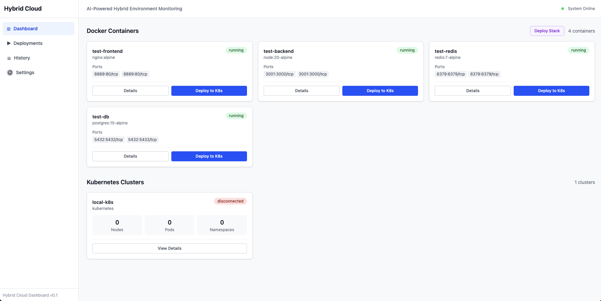

---

#### Step 2. 외부 클러스터 등록 (kubeconfig)

Settings 페이지에서 kubeconfig에 등록된 컨텍스트 목록을 확인하고, Register 버튼으로 외부 K8s 클러스터(GKE 등)를 등록합니다.

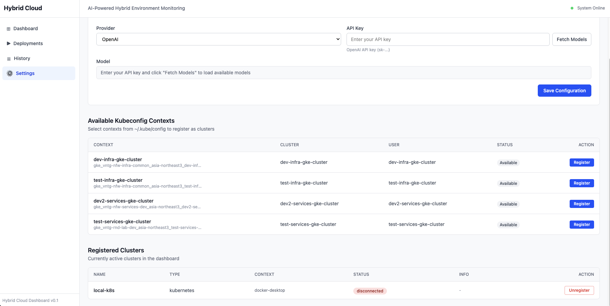

---

#### Step 3. AI API Key 등록

AI 매니페스트 생성을 위한 프로바이더를 선택하고 API Key를 입력합니다. 아직 설정 전이므로 "Not configured — using template fallback" 상태가 표시됩니다.

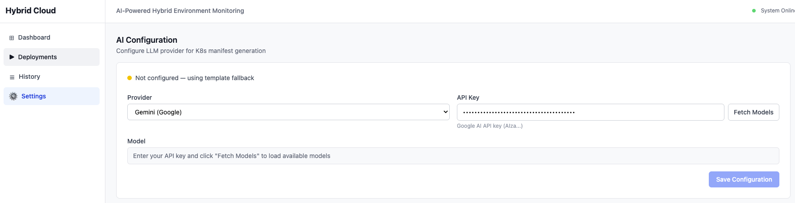

---

#### Step 4. AI 모델 선택

Fetch Models 버튼으로 사용 가능한 모델 목록을 API에서 조회합니다.

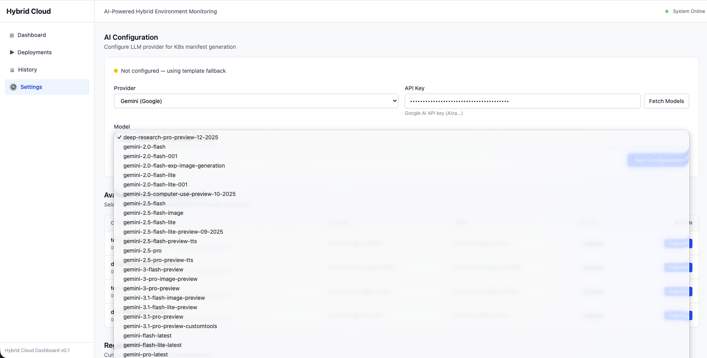

모델 선택 후 Save Configuration을 클릭하면 "Connected" 상태로 전환되며, AI 매니페스트 생성이 가능해집니다.

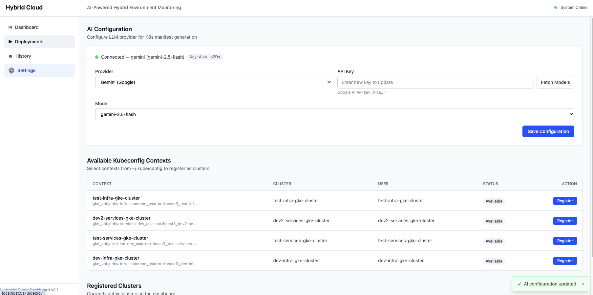

---

#### Step 5. 스택 배포 요청 — Deploy Stack

Deployments 페이지에서 Deploy Stack 버튼을 클릭하고, 배포할 컨테이너 4개를 선택합니다. 대상 클러스터(test-infra-gke-cluster)와 네임스페이스(good)를 지정하고, 요구사항을 입력하여 AI 매니페스트 생성을 요청합니다.

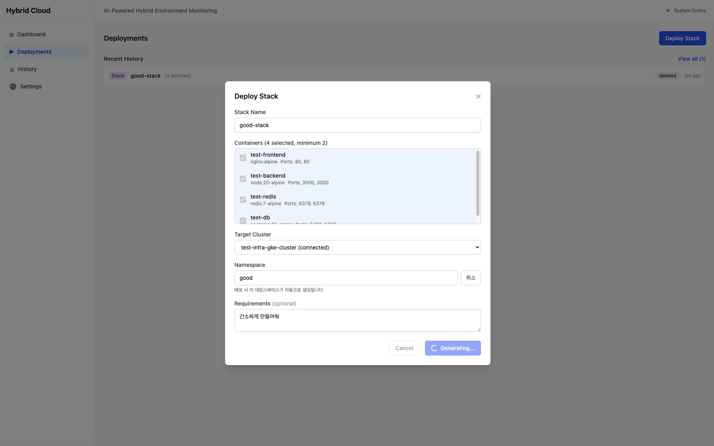

---

#### Step 6. AI 매니페스트 생성 중

3단계 스텝퍼(K8s 매니페스트 변환 → 매니페스트 확인 & 피드백 → 배포 실행)의 첫 번째 단계에서 AI가 컨테이너 정보를 분석하고 최적의 K8s 매니페스트를 생성합니다.

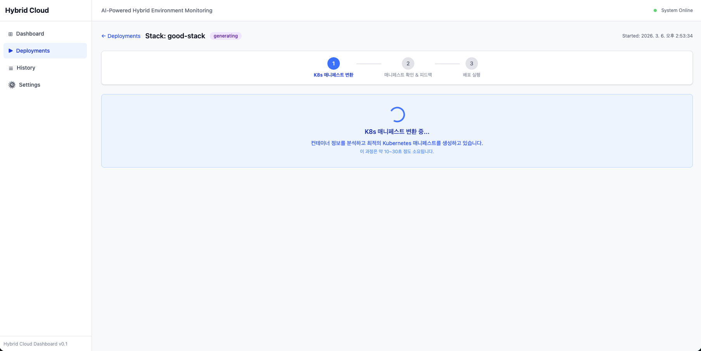

---

#### Step 7. AI 생성 Manifest 리뷰

AI가 생성한 스택 매니페스트를 리뷰합니다. 서비스 토폴로지, 배포 순서, 각 서비스별 Deployment/Service/ConfigMap 등의 YAML을 탭으로 전환하며 확인할 수 있습니다. AI Confidence 96%로 높은 신뢰도를 보여줍니다.

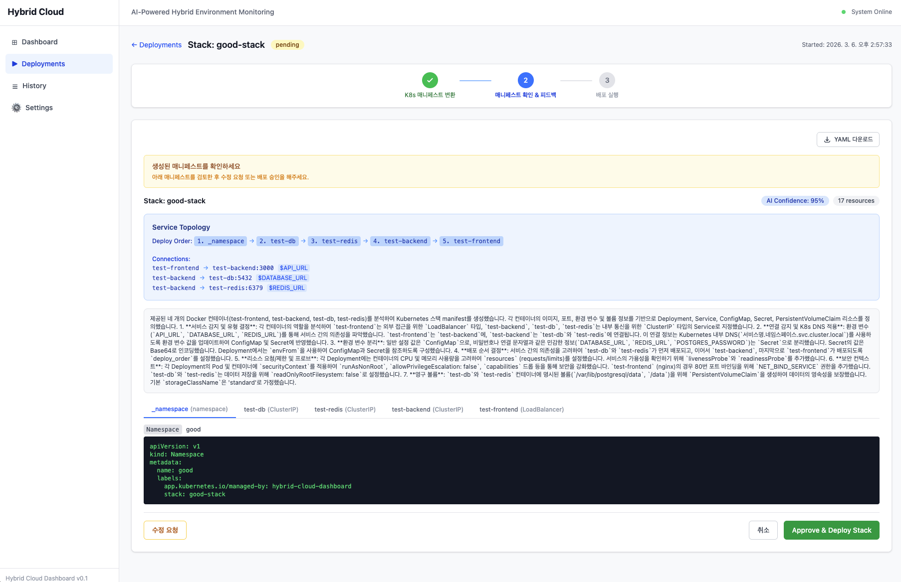

---

#### Step 8. 배포 완료

Approve & Deploy Stack 버튼으로 배포를 실행하면, Namespace 생성부터 각 서비스(test-db → test-redis → test-backend → test-frontend)가 순서대로 배포됩니다. 100% 완료 후 배포 요약 정보가 표시됩니다.

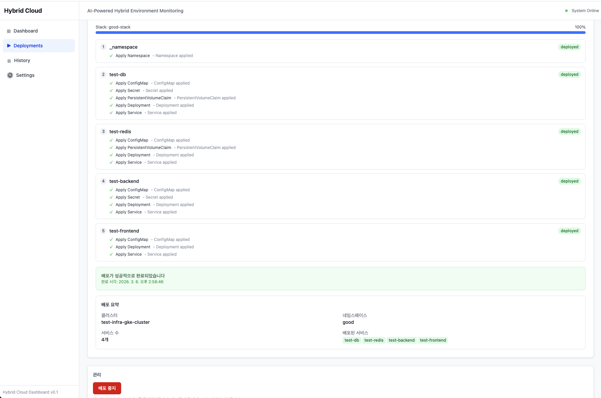

---

#### Step 9. 실제 K8s 리소스 확인

k9s로 실제 클러스터의 good 네임스페이스를 확인하면, 4개의 Pod가 생성된 것을 볼 수 있습니다.

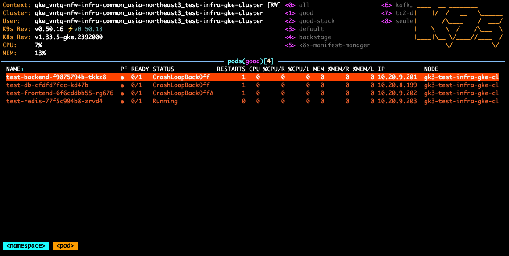

---

#### Step 10. 기존 배포 중단 (Undeploy)

배포 중지 버튼을 클릭하면 확인 다이얼로그가 표시됩니다. 확인 시 K8s에 배포된 리소스가 삭제되며, 매니페스트와 이력은 보존됩니다.

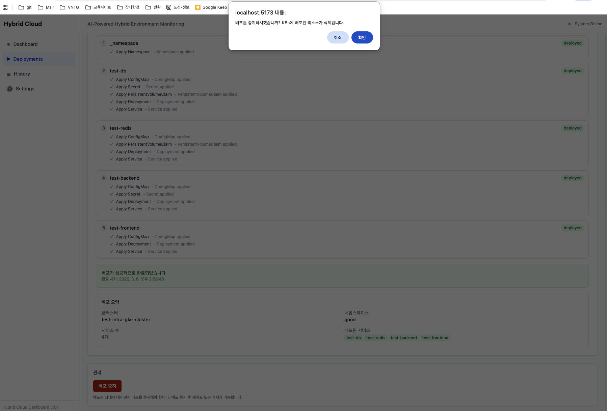

Undeploy 완료 후 상태가 "undeployed"로 변경됩니다. 이 상태에서 매니페스트 수정(Refine)이나 재배포가 가능합니다.

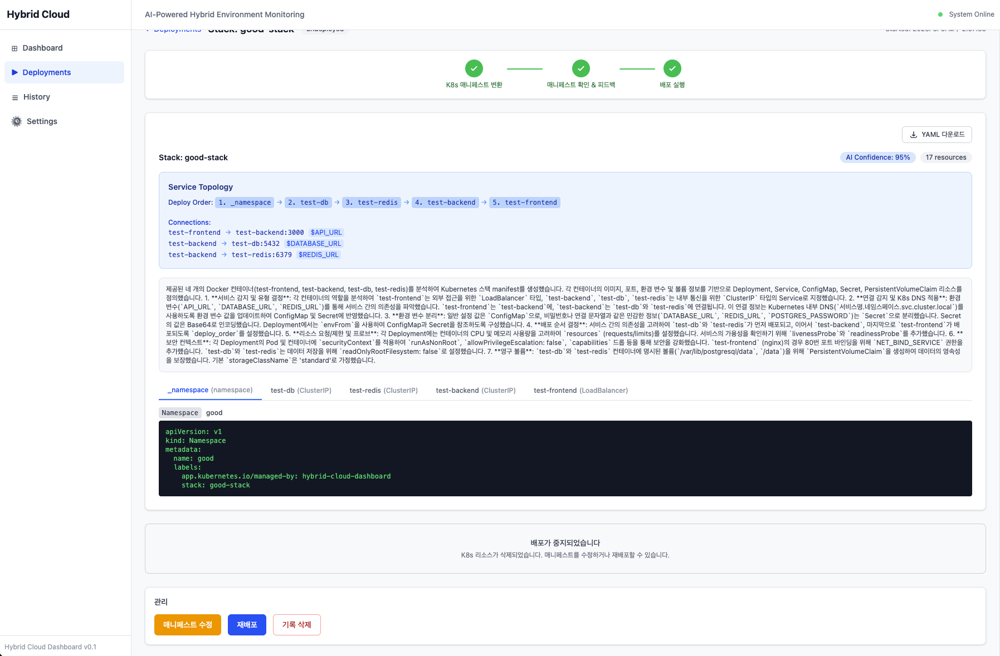

---

#### Step 11. 매니페스트 수정 (Refine)

Undeploy된 상태에서 수정 요청 버튼을 클릭하여 AI에게 매니페스트 수정을 요청할 수 있습니다.

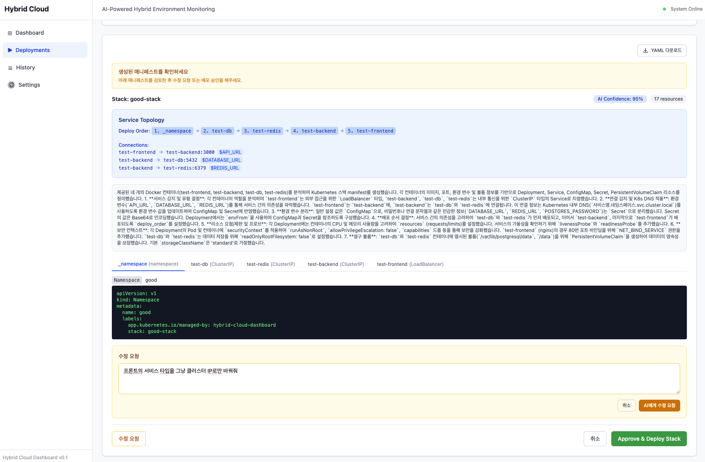

자연어로 수정 사항을 입력합니다. 예: "프론트의 서비스 타입을 그냥 클러스터 IP로만 바꿔줘"

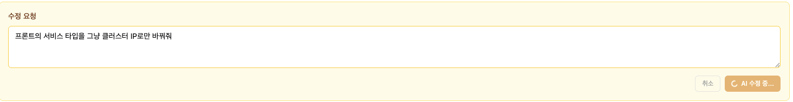

AI가 피드백을 반영하여 매니페스트를 수정합니다. test-frontend의 Service type이 LoadBalancer에서 ClusterIP로 변경된 것을 확인할 수 있습니다.

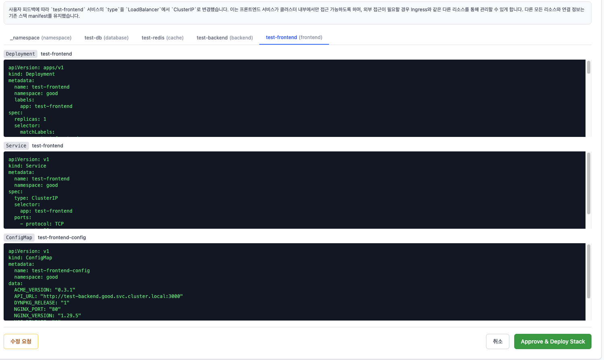

---

#### Step 12. 다른 클러스터에 재배포

수정된 매니페스트를 다른 K8s 클러스터를 선택하여 재배포할 수 있습니다. 매니페스트에 설정된 네임스페이스로 배포됩니다.

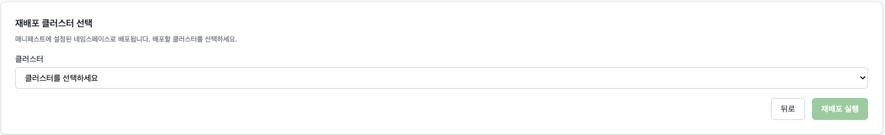

---

### 5.6 데이터베이스

| 테이블 | 용도 | 주요 컬럼 |
|--------|------|----------|
| deployment_history | 단일 배포 이력 | image, cluster, namespace, status, manifests, AI confidence |
| stack_deploys | 스택 배포 레코드 | topology, manifests, deploy_order, prompt, create_namespace |
| settings | 키-값 설정 | key, value (AI 프로바이더, API 키 등) |
| registered_clusters | 클러스터 등록 | name, context, kubeconfig, registry |

---

## 6. 개발 과정에서의 주요 이슈 및 해결

### 6.1 AI 응답 파싱 실패
- **문제**: Gemini가 JSON을 마크다운 코드 펜스(````json ... ````)로 감싸 반환하여 파싱 실패
- **해결**: `responseMimeType: "application/json"` 설정 + 4단계 파싱 파이프라인 구현 (코드 펜스 제거 → 중괄호 추출 → 잘린 JSON 복구)

### 6.2 AI API 타임아웃
- **문제**: Gemini API가 60초 타임아웃으로 빈번하게 실패 (특히 스택 배포)
- **해결**: HTTP 타임아웃 120초, 컨텍스트 타임아웃 5분, 3회 재시도 + 지수 백오프 (3s, 6s)

### 6.3 배포 삭제 시 히스토리 유실
- **문제**: 스택 삭제 시 in-memory 상태를 먼저 제거하여 DB soft-delete 실패
- **해결**: DB에 "deleted" 상태 먼저 영속화 → 이후 메모리에서 제거 순서로 변경

### 6.4 서버 재시작 후 네임스페이스 리소스 유실
- **문제**: `CreateNamespace`, `Prompt` 필드가 DB에 저장되지 않아 서버 재시작 후 재생성 시 Namespace 매니페스트 누락
- **해결**: DB 스키마에 컬럼 추가 (ALTER TABLE 마이그레이션) + 저장/복원 로직 구현

### 6.5 .gitignore 패턴 오류
- **문제**: `data/`, `models/` 패턴이 `backend/internal/data/`, `backend/pkg/models/`까지 매칭하여 핵심 소스 파일이 Git에서 누락
- **해결**: 루트 한정 패턴(`/data/`, `/models/`)으로 변경

---

## 7. Git 커밋 이력

| # | 해시 | 커밋 메시지 | 주요 내용 |
|---|------|-----------|----------|
| 1 | `6be1c52` | `chore: initial project setup with design documents` | 프로젝트 초기 구조, 설계 문서 |
| 2 | `9539fb0` | `feat(api): add Go backend skeleton with Gin server and service interfaces` | Go 백엔드 스켈레톤, 서비스 인터페이스 |
| 3 | `19c3892` | `feat(ui): add React frontend skeleton with dashboard, deploy, and log pages` | React 프론트엔드 스켈레톤 |
| 4 | `0a0cc08` | `feat(api,ui): implement full stack deploy lifecycle with AI manifest generation` | 스택 배포 + AI 매니페스트 생성 구현 |
| 5 | `36f9002` | `feat(api,ui): real K8s deploy, deploy history redesign, and bug fixes` | 실 K8s 배포, 히스토리 리디자인, 설정 페이지 |
| 6 | `6cf84c1` | `feat(ai,api,ui): improve AI reliability, add deploy prompt, fix delete history bug` | AI 신뢰성 개선, 프롬프트 기능, 버그 수정 |
| 7 | `a0c43da` | `docs: sync all documentation and configs with current implementation` | 7개 문서/설정 현행화 |

---

## 8. 프로젝트 구조

```
AI_Project/
├── backend/                          # Go 백엔드 (~9,100 LOC)
│   ├── cmd/server/main.go            # 진입점
│   ├── internal/
│   │   ├── api/                      # REST + WebSocket 핸들러 (42+5)
│   │   │   ├── router.go             # 라우트 정의
│   │   │   ├── handlers_docker.go    # Docker 컨테이너 관리
│   │   │   ├── handlers_k8s.go       # K8s 리소스 관리
│   │   │   ├── handlers_deploy.go    # 단일 배포
│   │   │   ├── handlers_stack_deploy.go  # 스택 배포 (1,543 LOC)
│   │   │   ├── handlers_config.go    # 설정/클러스터 관리
│   │   │   ├── websocket.go          # 실시간 메트릭/로그/상태
│   │   │   └── middleware.go         # CORS, 로깅
│   │   ├── ai/ai.go                  # AI 엔진 (1,443 LOC) — 3 프로바이더
│   │   ├── docker/docker.go          # Docker SDK 래퍼
│   │   ├── kubernetes/kubernetes.go  # K8s client-go 래퍼
│   │   ├── data/store.go             # SQLite 데이터 레이어 (942 LOC)
│   │   ├── registry/registry.go      # Container Registry
│   │   ├── metrics/metrics.go        # 메트릭 수집
│   │   └── config/config.go          # YAML 설정 로더
│   └── pkg/models/models.go          # 공유 데이터 모델 (40+ 구조체)
│
├── frontend/                         # React 프론트엔드 (~5,800 LOC)
│   └── src/
│       ├── api/
│       │   ├── types.ts              # TypeScript 타입 (40+ 인터페이스)
│       │   └── client.ts             # Axios API 클라이언트
│       ├── hooks/                    # React Query + WebSocket 훅 (6개)
│       ├── pages/                    # 페이지 컴포넌트 (6개)
│       ├── components/
│       │   ├── dashboard/            # Dashboard, ContainerCard, ClusterOverview
│       │   ├── deploy/               # DeployModal, StackDeployModal, 매니페스트 프리뷰
│       │   ├── common/               # LoadingSpinner, StatusBadge, MetricChart, Toast
│       │   └── layout/               # Layout (사이드바 + 헤더)
│       └── utils/formatters.ts       # 포맷 유틸리티
│
├── configs/
│   ├── config.example.yaml           # 설정 예시 (서버, AI, Docker, K8s, DB 등)
│   └── config.yaml                   # 실제 설정 (gitignore)
│
├── docs/                             # 문서
│   ├── API_SPEC.md                   # API 명세 (47 엔드포인트)
│   ├── ARCHITECTURE.md               # 시스템 아키텍처
│   ├── AI_MANIFEST_GENERATOR.md      # AI 엔진 상세
│   ├── SETUP.md                      # 개발 환경 설정
│   └── AI_WORKER_LEVEL.md            # 과제 사양서
│
├── CLAUDE.md                         # AI 코딩 어시스턴트 가이드
├── README.md                         # 프로젝트 소개
└── docker-compose.yml                # 전체 시스템 실행
```

---

## 9. 실행 방법

### 9.1 Docker Compose (전체 시스템)
```bash
cp configs/config.example.yaml configs/config.yaml  # 설정 파일 생성
# config.yaml에서 AI API 키 설정
docker-compose up -d
# Frontend: http://localhost:3000, Backend: http://localhost:8080
```

### 9.2 로컬 개발
```bash
# Backend
cd backend
export GEMINI_API_KEY=your-key
go run cmd/server/main.go

# Frontend (별도 터미널)
cd frontend
npm install && npm run dev
# http://localhost:5173
```

---

## 10. 결론

### 10.1 달성 성과
- **42 REST + 5 WebSocket API** 완전 구현 (약 14,900 LOC)
- **3개 AI 프로바이더** (OpenAI, Claude, Gemini) 런타임 전환 지원
- **단일 + 스택 배포** 전체 라이프사이클 구현 (생성 → 리뷰 → 배포 → 언디플로이 → 재배포 → 삭제)
- **Few-shot Learning** 기반 점진적 품질 향상 (배포 이력 축적 → 유사 사례 검색 → 프롬프트 강화)
- **장애 내성**: 3회 재시도 + 지수 백오프, 4단계 JSON 파싱 복구, 템플릿 fallback
- **실시간 모니터링**: WebSocket 기반 CPU/메모리/네트워크 메트릭 차트, 로그 스트리밍

### 10.2 향후 개선 방향
- 프로덕션 배포를 위한 인증/인가 시스템 추가
- 배포 후 실제 리소스 사용량 피드백 루프 (AI 추천 정확도 향상)
- Helm Chart 지원
- 멀티 테넌시 지원
- 알림 시스템 (Slack, Email)
